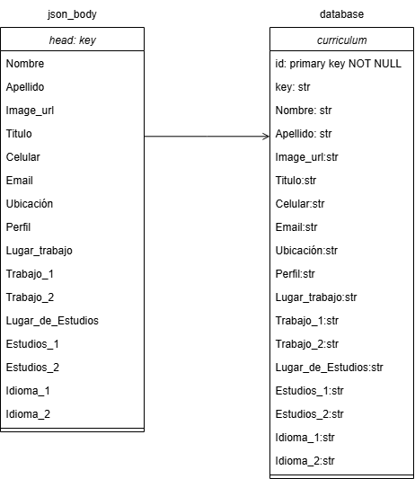

# [Ayudantes IIC1005 - Exploratorio de computación] - Experiencia: WEB-3: Aprendiendo a trabajar con API´s

Este repositorio almacena todo lo necesario para poder correr la API necesaria para WEB-3

# Instalaciones escenciales:

## Windows:

1. Debes tener Node.js, puedes instalar todo desde: https://nodejs.org/es - > Asegurate de tener la LTS (Long Term Version)
2. En tu powershell comprueba que todo se ha instalado correctamente con:
   ```
   node -v
   npm -v 
   # Estos comandos deberian indicarte la versión de node y npm. Si instalaste todo bien entonces debería aparecerte una versión superior o igual a 22.20.0.
   ```
3. Inicializa el proyecto con
   ```
   npm init -y
   # Esto crea package.json
   ```

4. Instalar paquetes necesarios:
   ```
   npm install express sqlite3 express-rate-limit 
   # express → framework del servidor.
   # sqlite3 → base de datos SQLite para almacenar los curriculum.
   npm install --save-dev nodemon
   # nodemon → Permite reiniciar el server automáticamente en caso de hacer cambios (OPCIONAL)
   ```
5. opcional:
   Instalar ngrok para probar la api local en internet.
   ```
   npm install --save-dev ngrok
   ```
   Normalmente esto les pedira un authtoken, para esto deben ingresar en https://dashboard.ngrok.com/signup y registrarse.
   una vez que tengan su authtoken deben usar:
   ```
   npx ngrok config add-authtoken Authtoken
   ```
## Levantar en local:
1. Para arrancar el servidor en local (solo uso propio):
   ```
   npm install
   npm start # Primera vez
   npm run dev # Si instalaste nodemon
   ```
   Con esto podras hacer consultas desde la ip y postman de forma LOCAL. 
2. Para arrancar el servidor publicamente, debentener instalado ngrok (paso 5), correr los siguientes comandos EN TERMINALES DISTINTAS.
   ```
   npm install
   #Si no instalaste nodemon:
   npm start  
   #Si instalaste nodemon:
   npm run dev 

   #Para arrancar el servidor con ngrok, desde otra terminal debes correr:
   npx ngrok http XXXX <Cambiar por el puerto asignado>
   ```
# Diagrama Api y Base de datos:
   
# Metodos de la API:
#### Obtener la user-key

<details>
 <summary><code>GET</code> <code><b>/{numero_alumno}</b></code> <code>(Te entrega la key que necesitas para futuras consultas)</code></summary>

##### Parameters

> | name      |  type     | data type               | description                                                           |
> |-----------|-----------|-------------------------|-----------------------------------------------------------------------|
> | numero_alumno      |  required | string   | Numero de alumno del quien hace la consulta  |


##### Responses

> | http code     | content-type                      | response                                                            |
> |---------------|-----------------------------------|---------------------------------------------------------------------|
> | `200`         | `json`        | `{message: "", "key": apikey, "numero_alumno": params.numero_alumno}`                                |
> | `400`         | `json`                | `{"code":"400","message":"ingresa un número de alumno válido", field: "numero_alumno", "value": params.value }`                            |                                                           |

##### Example cURL

> ```javascript
>  curl -X GET "http://localhost:8889/12345" -H "Content-Type: application/json"
> ```

</details>

------------------------------------------------------------------------------------------
